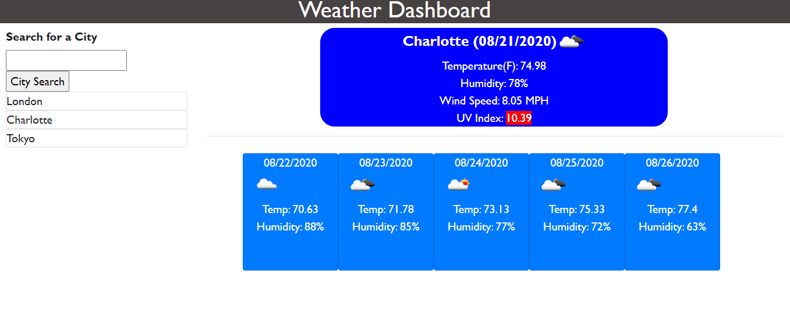

# WeatherDashboard

## Description
This is an application that will allow the end user to enter a city and retrieve current and future weather data.  The app uses HTML, CSS, JQuery and a Third Party Web API.

## Screenshot of Website  
;

## Deployed site

[WeatherDashboard](https://sford4186.github.io/WeatherDashboard/)